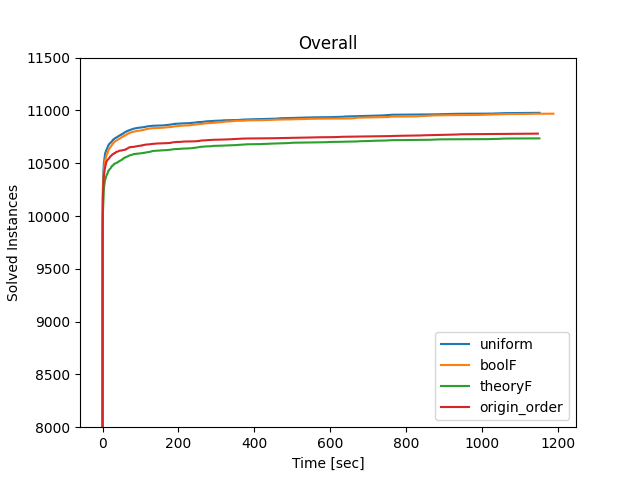
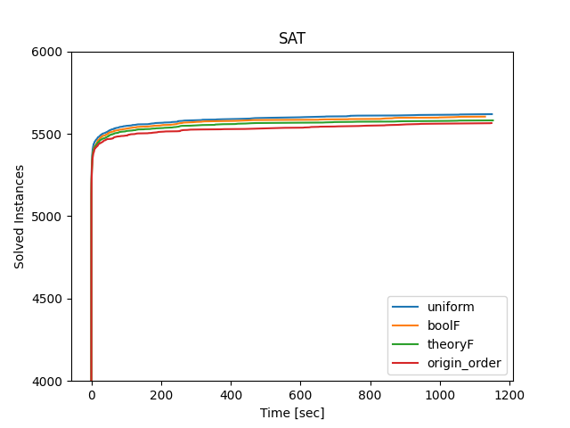
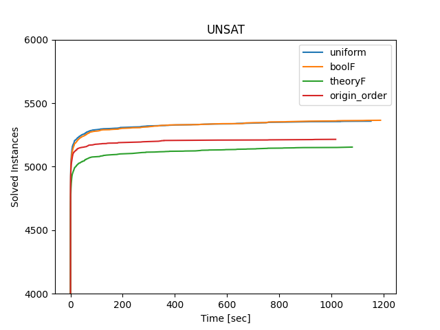
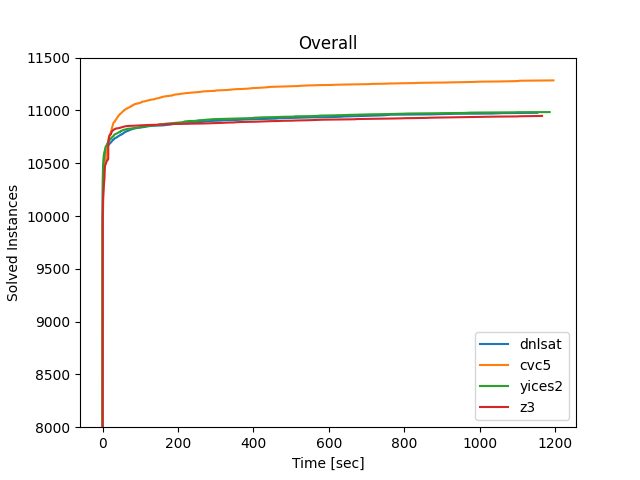
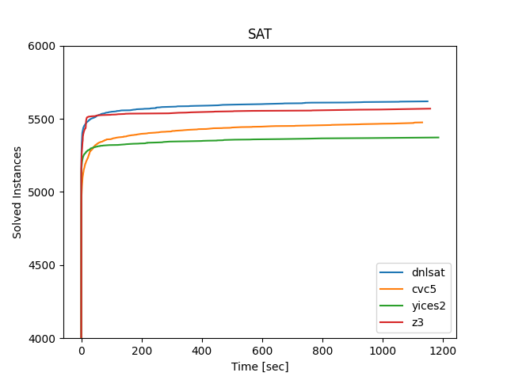
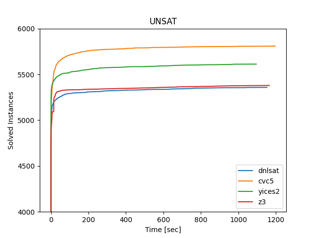
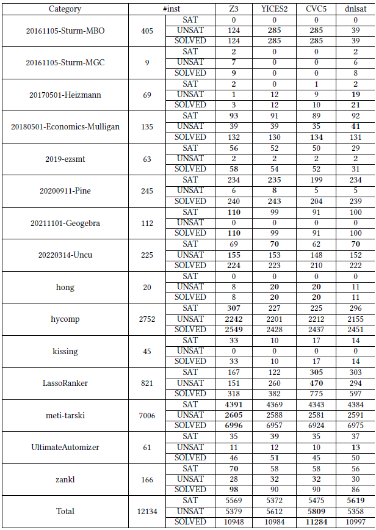

# DNLSAT: A Dynamic Variable Ordering MCSAT Framework for Nonlinear Real Arithmetic

Benchmark: [SMT-LIB QF_NRA](https://zenodo.org/records/10607722/files/QF_NRA.tar.zst?download=1)

Code structure: [code structure](code/README.md)

Detailed data: [data](data/)

## Installation
DNLSAT is implemented based on Z3 Prover (https://github.com/Z3Prover/z3). The compilation methid is similar to Z3.

```
cd code
python scripts/mk_make.py
cd build
make -j<num_threads>
```

## Usage
```
cd code/build
./z3 <input_file>
```

## Experiments
### Comparison between different branching heuristics




## Comparison with other SMT(NRA) solvers






## Contact
Main developer: Zhonghan Wang ([wangzh@ios.ac.cn](mailto:wangzh@ios.ac.cn))

Refer to the [personal page](https://yogurt-shadow.github.io/) to find something more interesting.
