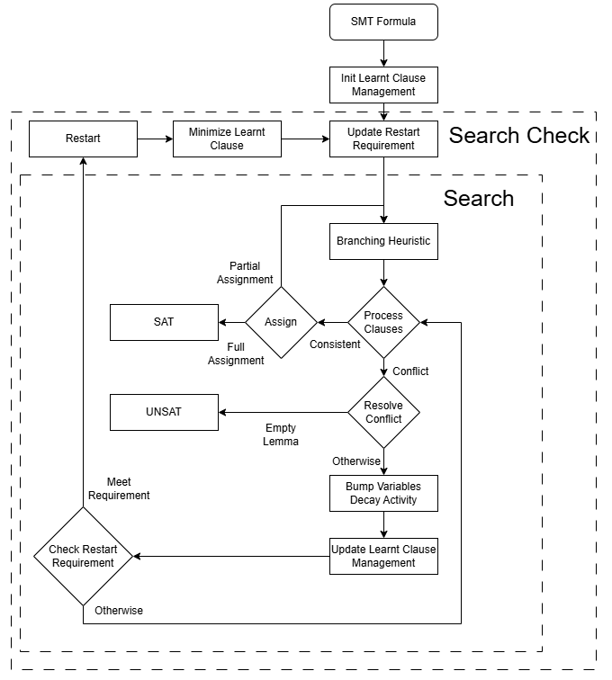

## Code Structure (For Developers)

`src/nlsat/nlsat_dynamic.h`: Interface of dynamic variable orderings.
- Watched Variables: used to detect univariate clauses.
- Assignment Stack: used to store the assignment history.
- Dynamic Variable Ordering Comparator: please modify the macro definition of `DYNAMIC_MODE` in `nlsat_dynamic.h`

`src/nlsat/nlsat_solver.cpp`: The main solver code.